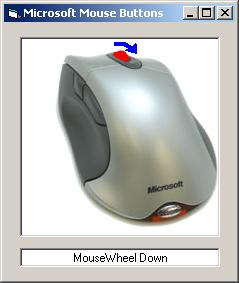



## Capturing the Extra Mouse Button Events

### Description

This program will demonstrate how to capture the extra mouse buttons such as the mouse wheel and x buttons (the buttons on the side of the mouse).

Mouse Hooking is employed so these the events can be captured independantly of the controls.
 
### More Info
 

             |
---                |---
**Submitted On**   |2004-10-25 02:01:02
**By**             |[Phobos](https://github.com/Planet-Source-Code/PSCIndex/blob/master/ByAuthor/phobos.md)
**Level**          |Advanced
**User Rating**    |5.0 (35 globes from 7 users)
**Compatibility**  |VB 6\.0
**Category**       |[Files/ File Controls/ Input/ Output](https://github.com/Planet-Source-Code/PSCIndex/blob/master/ByCategory/files-file-controls-input-output__1-3.md)
**World**          |[Visual Basic](https://github.com/Planet-Source-Code/PSCIndex/blob/master/ByWorld/visual-basic.md)
**Archive File**   |[Capturing\_18097910252004\.zip](https://github.com/Planet-Source-Code/phobos-capturing-the-extra-mouse-button-events__1-56909/archive/master.zip)

